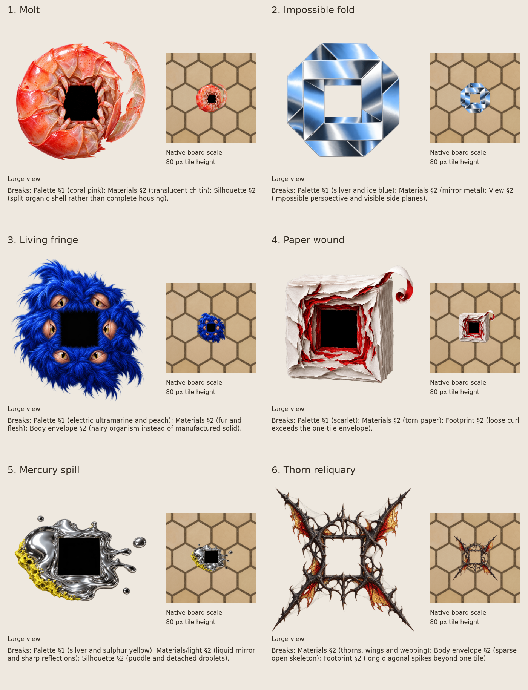

# Portal frame explorations

Open exploration awaiting a pick in issue #150. These six paintings are independent of the art bible; none replaces the shipped portal. Each sheet caption names the rules that direction breaks.



| Candidate | Direction and bible departures | Actual image caption | Painting |
|---|---|---|---|
| Molt | [brief](01-molt/brief.md) | [caption](01-molt/prompt.txt) | [paint](01-molt/paint.png) |
| Impossible fold | [brief](02-fold/brief.md) | [caption](02-fold/prompt.txt) | [paint](02-fold/paint.png) |
| Living fringe | [brief](03-fur/brief.md) | [caption](03-fur/prompt.txt) | [paint](03-fur/paint.png) |
| Paper wound | [brief](04-paper/brief.md) | [caption](04-paper/prompt.txt) | [paint](04-paper/paint.png) |
| Mercury spill | [brief](05-fluid/brief.md) | [caption](05-fluid/prompt.txt) | [paint](05-fluid/paint.png) |
| Thorn reliquary | [brief](06-thorn/brief.md) | [caption](06-thorn/prompt.txt) | [paint](06-thorn/paint.png) |

## Repaint

From the repository root, inside `nix-shell`, choose a candidate directory as `candidate` and run:

```sh
art/direct.sh "$(cat "$candidate/brief.md")" > "$candidate/prompt.txt"
art/paint.sh -s 1024 "$candidate/paint.png" "$candidate/prompt.txt"
```

To reuse the exact painted caption, run only the second command. The paint script removes the provenance footer before sending the caption unchanged, verifies the image call, rejects non-square returns, and resizes uniformly. These paintings have no reference attachments. The adjacent briefs are the complete exploration directions; the shipped shared style is deliberately excluded. Registration, palette and automatic selection gates from the shipped manifest do not select an exploration winner.

The sheet is an albedo placement study, not a proposed runtime patch. Each native-size panel uses an unscaled crop of the actual board renderer. The default camera renders a hex circumradius of 20 world units at two pixels per world unit: a tile is 80 pixels high. Each candidate is scaled uniformly, with its central body approximately one tile high. Paper and thorn extensions intentionally exceed that footprint. Separate large views expose the material and silhouette. The empty apertures are painted placeholders, not a replacement for the canonical live interior preview. No caption is drawn inside a game panel.

Board provenance: `cargo run -- --shot board-full.png portal 8` on `e58673c`; `board.png` is the unscaled 240 by 240 crop at `(935, 240)`. It contains only game tiles, with no interface lettering. To recreate the crop:

```sh
magick board-full.png -crop 240x240+935+240 +repage -strip board.png
```

Placement uses the machine pipeline's green-spill alpha rule: `spill = green - max(red, blue)`, `alpha *= 1 - clamp((spill - 0.1) / 0.5, 0, 1)`, then subtracts positive spill from green. Returned transparency is retained. The entire square image is uniformly reduced to the following side lengths and centered over the native board crop; nothing is clipped, stretched or warped. Each `board.png` beside its painting is that exact native-size panel. The large view uniformly reduces the full painting to 400 by 400 pixels.

| Candidate | Native placement canvas, pixels |
|---|---:|
| Molt | 96 |
| Impossible fold | 104 |
| Living fringe | 88 |
| Paper wound | 112 |
| Mercury spill | 128 |
| Thorn reliquary | 128 |

These different canvas sizes account for the paintings' different margins and extended silhouettes. They are presentation scales, not proposed changes to gameplay footprints. The full sheet must be opened at native resolution to compare the shipped-size panels without browser scaling.
