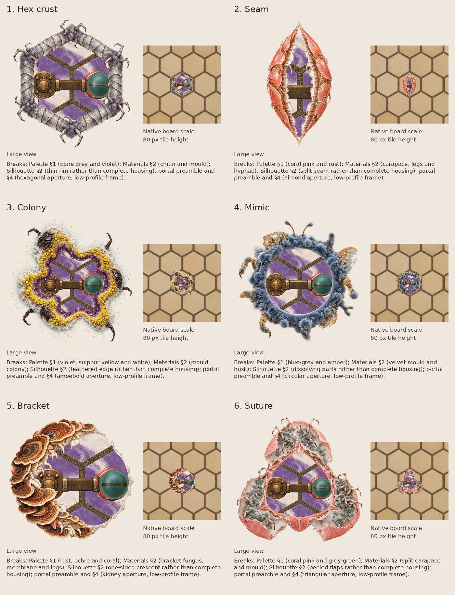

# Portal frame round two: Molt, steered

Round two of the exploration in issue #150 follows the Molt pick recorded in `DESIGN.md`: organic mould with legs and carapace growing from it. Each frame is a thin rim, so the interior fills most of the tile, and each tests a different opening. None replaces the shipped portal; the next pick stays open in the issue.



| Candidate | Opening | Brief and departures | Actual image caption | Painting | Native panel |
|---|---|---|---|---|---|
| Hex crust | hexagon | [brief](01-hex/brief.md) | [caption](01-hex/prompt.txt) | [paint](01-hex/paint.png) | [board](01-hex/board.png) |
| Seam | almond | [brief](02-seam/brief.md) | [caption](02-seam/prompt.txt) | [paint](02-seam/paint.png) | [board](02-seam/board.png) |
| Colony | amoeboid | [brief](03-colony/brief.md) | [caption](03-colony/prompt.txt) | [paint](03-colony/paint.png) | [board](03-colony/board.png) |
| Mimic | circle | [brief](04-mimic/brief.md) | [caption](04-mimic/prompt.txt) | [paint](04-mimic/paint.png) | [board](04-mimic/board.png) |
| Bracket | kidney | [brief](05-bracket/brief.md) | [caption](05-bracket/prompt.txt) | [paint](05-bracket/paint.png) | [board](05-bracket/board.png) |
| Suture | rounded triangle | [brief](06-suture/brief.md) | [caption](06-suture/prompt.txt) | [paint](06-suture/paint.png) | [board](06-suture/board.png) |

The paintings follow their briefs loosely in places: Colony and Suture rims are wider than the briefed tenth of the object, and Mimic adds two translucent wing husks.

## Repaint

Round one's [repaint commands](../README.md#repaint) apply unchanged with a directory from this table as `candidate`. There are no reference attachments. All six returned transparent backgrounds with transparent openings, so the placement uses the returned alpha as is.

## Placement

The openings show the portal's interior instead of round one's black placeholder. `interior.png` is frame `00167.png` of `cargo run -- --shot <dir> portal 8 7 400 1` on `bc9e639`, after the camera has crossed into the starting portal: ethereal tiles and the arm. It is the unscaled 660 by 600 crop at `(305, 30)`:

```sh
magick 00167.png -crop 660x600+305+30 +repage -strip interior.png
```

The opening is the region the painting encloses: alpha thresholded at one half, sealed by a closing of ten 3 by 3 iterations, holes filled, the largest hole kept. `interior.png` is scaled uniformly to cover that hole's bounding box, centred on it, and drawn beneath the painting through the hole grown by eight pixels. Today the canonical preview fits the interior extent inside a square aperture; how a non-square opening frames that extent is decided with the pick, not here.

Each composite is reduced uniformly until the painting's opaque silhouette, legs included, is 80 pixels high, one tile. It is centred over round one's unscaled [board crop](../board.png), which matches the renderer pixel for pixel on `bc9e639`. The large view reduces the whole composite to 400 by 400 pixels. Nothing is clipped, stretched or warped, and no caption is drawn inside a game panel.

| Candidate | Native placement canvas, pixels |
|---|---:|
| Hex crust | 82 |
| Seam | 83 |
| Colony | 85 |
| Mimic | 87 |
| Bracket | 86 |
| Suture | 84 |
